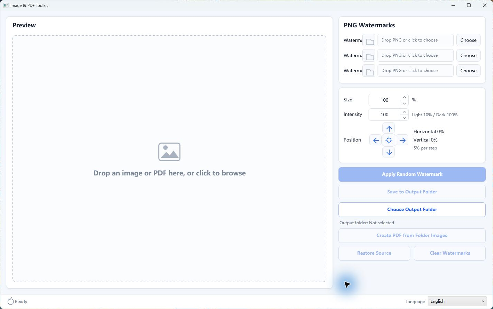

# ImagePdfToolkit

[English](README.md) | [简体中文](README.zh-CN.md)

[](https://dotnet.microsoft.com/)
[](https://www.microsoft.com/windows)
[](LICENSE)
[](https://github.com/shadiao719/ImagePdfToolkit/releases/latest)

ImagePdfToolkit (Image & PDF Toolkit) is a lightweight local Windows desktop application for watermarking images and converting between images and PDF. Built with WPF and MVVM, it supports randomized PNG watermarks, merging images into a PDF, and extracting every PDF page as a PNG image.



> English interface with the runtime language selector in the bottom-right corner.

## Download

Download the latest ready-to-run Windows package from the [Releases page](https://github.com/shadiao719/ImagePdfToolkit/releases/latest).

1. Download `ImagePdfToolkit-v1.2.0-win-x64.zip`.
2. Extract the ZIP file to any folder.
3. Run `ImagePdfToolkit.exe`.

The portable build is self-contained and does not require a separate .NET installation. Windows may show a SmartScreen warning because the executable is not code-signed; review the publisher information and choose to run it only if you downloaded it from this repository.

On first launch, the application follows the Windows display language. You can switch between **System default**, **English**, and **简体中文** at any time from the language selector in the status bar. The selection is remembered for future launches.

## Features

- Drag and drop or select a source image: PNG, JPG, BMP, GIF, or TIFF
- Configure up to 10 PNG watermark candidates
- Randomize watermark selection, rotation, opacity, and placement
- Adjust watermark size and color intensity
- Move the watermark with four directional buttons in 5% steps
- Reset the watermark position with the center button
- Preview and save the processed image
- Remember the last source image, watermarks, output folder, and settings
- Merge images from the output folder into a PDF
- Drop or select a PDF, choose a destination folder, and export every page as a PNG image
- Create a collision-safe `{PDF name}_pages` subfolder for each PDF extraction
- Process all images locally without uploading them to a server
- Switch between English and Simplified Chinese at runtime
- Follow the Windows display language automatically by default

## Requirements for Development

- Windows 10 or Windows 11
- [.NET 10 SDK](https://dotnet.microsoft.com/download/dotnet/10.0)
- Visual Studio 2026 or another .NET-compatible development environment (optional)

## Build from Source

Clone the repository:

```powershell
git clone https://github.com/shadiao719/ImagePdfToolkit.git
cd ImagePdfToolkit
```

Build and run:

```powershell
dotnet build
dotnet run --project ImagePdfToolkit.csproj
```

You can also open `ImagePdfToolkit.slnx` in Visual Studio and run the project directly.

## Usage

1. Drop a source image into the preview area or choose one from disk.
2. Add one or more PNG watermarks on the right.
3. Adjust the size, intensity, and position.
4. Select **Apply Random Watermark** to preview a result.
5. Choose an output folder different from the source folder, then save the result.
6. To merge output images, select **Create PDF from Folder Images**.

To extract a PDF, drop it into the preview area or select it from the file picker. Choose a destination folder when prompted; the application creates a new `{PDF name}_pages` subfolder and saves each page as `page-001.png`, `page-002.png`, and so on.

## Project Structure

```text
Controls/        Custom WPF controls
Infrastructure/ MVVM infrastructure
Models/          Data models and constants
Resources/       English and Simplified Chinese language dictionaries
Services/        Image, PDF, settings, and dialog services
ViewModels/      Main window view model
design/          Interface design preview
```

## Contributing

Issues and pull requests are welcome. Before submitting code, make sure the Release build succeeds:

```powershell
dotnet build -c Release
```

## License

This project is available under the [MIT License](LICENSE). PDF rendering is provided by the MIT-licensed [PDFtoImage](https://github.com/sungaila/PDFtoImage) library.
