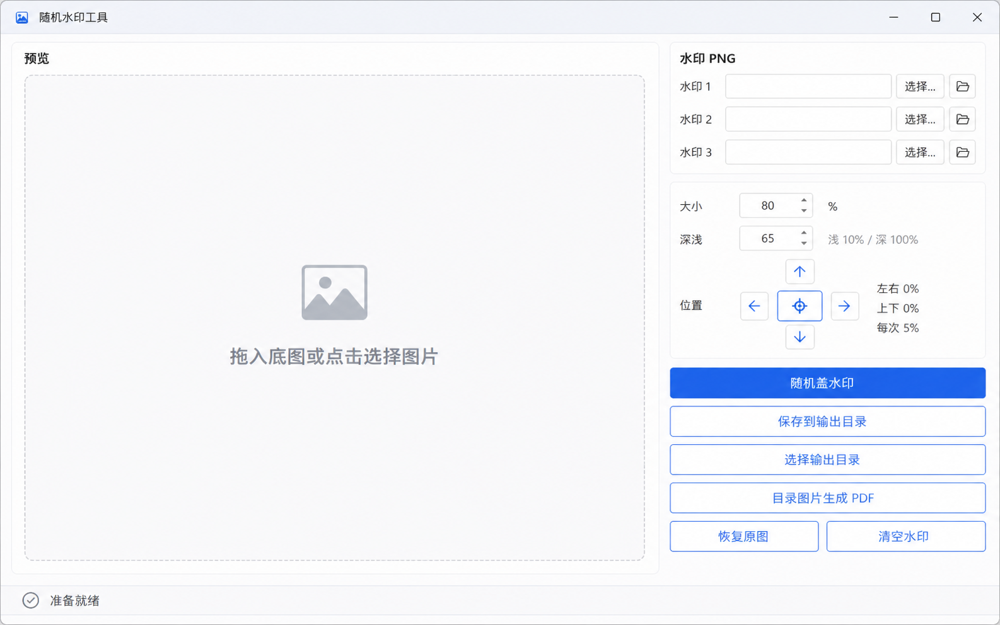

# RandomWatermarkTool

[English](README.md) | [简体中文](README.zh-CN.md)

[](https://dotnet.microsoft.com/)
[](https://www.microsoft.com/windows)
[](LICENSE)
[](https://github.com/shadiao719/RandomWatermarkTool/releases/latest)

RandomWatermarkTool 是一个面向 Windows 的轻量级随机水印桌面工具。它使用 WPF 和 MVVM 构建，可以从多个 PNG 水印中随机选择、随机旋转并叠加到底图上，也可以将输出目录中的图片合并为 PDF。



> 上图为 WPF 界面设计预览，实际显示效果可能随窗口尺寸和系统字体略有不同。

## 下载使用

请从 [Releases 页面](https://github.com/shadiao719/RandomWatermarkTool/releases/latest)下载最新的 Windows 免安装版。

1. 下载 `RandomWatermarkTool-v1.0.0-win-x64.zip`。
2. 将 ZIP 文件解压到任意文件夹。
3. 运行 `RandomWatermarkTool.exe`。

免安装版已经包含运行所需的 .NET 组件，不需要另外安装 .NET。由于程序暂未购买代码签名证书，Windows 可能显示 SmartScreen 提示；请确认文件来自本仓库后再选择运行。

## 功能

- 拖放或选择底图，支持 PNG、JPG、BMP、GIF 和 TIFF
- 最多配置 10 个 PNG 水印槽位
- 随机选择水印、旋转角度、透明度和位置
- 调整水印大小与颜色深浅
- 使用上下左右四方向键移动水印，每次移动 5%
- 中心按钮一键将水印位置归零
- 实时预览并保存处理后的图片
- 记忆上次使用的底图、水印、输出目录及参数
- 将输出目录中的图片按顺序合并为 PDF
- 所有图片处理均在本机完成，不会上传到网络

## 开发环境

- Windows 10 或 Windows 11
- [.NET 10 SDK](https://dotnet.microsoft.com/download/dotnet/10.0)
- Visual Studio 2026（可选）或其他支持 .NET 的开发工具

## 从源码运行

克隆仓库：

```powershell
git clone https://github.com/shadiao719/RandomWatermarkTool.git
cd RandomWatermarkTool
```

构建并运行：

```powershell
dotnet build
dotnet run --project RandomWatermarkTool.csproj
```

也可以使用 Visual Studio 打开 `RandomWatermarkTool.slnx` 后直接运行。

## 使用方法

1. 将底图拖入左侧预览区，或点击选择底图。
2. 在右侧添加一个或多个 PNG 水印。
3. 调整大小、深浅和水印位置。
4. 点击“随机盖水印”查看结果。
5. 选择一个与原图目录不同的输出目录，然后保存结果。
6. 如需合并图片，点击“目录图片生成 PDF”。

## 项目结构

```text
Controls/        自定义 WPF 控件
Infrastructure/ MVVM 基础设施
Models/          数据模型与常量
Services/        图片处理、PDF、设置和对话框服务
ViewModels/      主窗口视图模型
design/          界面设计预览
```

## 参与贡献

欢迎提交 Issue 或 Pull Request。提交代码前，请先确保项目能够成功构建：

```powershell
dotnet build -c Release
```

## 许可证

本项目使用 [MIT License](LICENSE) 开源。

