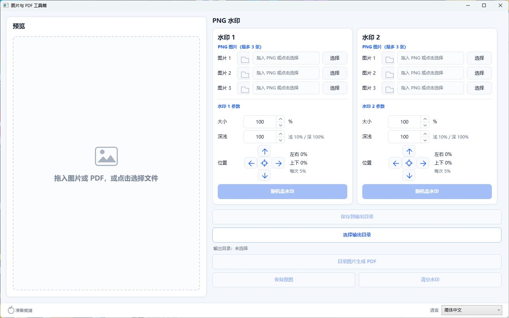

# ImagePdfToolkit

[English](README.md) | [简体中文](README.zh-CN.md)

[](https://dotnet.microsoft.com/)
[](https://www.microsoft.com/windows)
[](LICENSE)
[](https://github.com/shadiao719/ImagePdfToolkit/releases/latest)

ImagePdfToolkit（图片与 PDF 工具箱）是一款面向 Windows 的轻量级本地图片处理工具。它使用 WPF 和 MVVM 构建，支持随机 PNG 水印、图片合并为 PDF，以及将 PDF 的每一页拆分为 PNG 图片。



> 简体中文界面，右下角包含运行时语言选择器。

## 下载使用

请从 [Releases 页面](https://github.com/shadiao719/ImagePdfToolkit/releases/latest)下载最新的 Windows 免安装版。

1. 下载 `ImagePdfToolkit-v1.3.0-win-x64.zip`。
2. 将 ZIP 文件解压到任意文件夹。
3. 运行 `ImagePdfToolkit.exe`。

免安装版已经包含运行所需的 .NET 组件，不需要另外安装 .NET。由于程序暂未购买代码签名证书，Windows 可能显示 SmartScreen 提示；请确认文件来自本仓库后再选择运行。

程序首次启动时会自动跟随 Windows 显示语言。状态栏右侧可以随时选择“跟随系统 / English / 简体中文”，选择结果会在下次启动时继续使用。

## 功能

- 拖放或选择底图，支持 PNG、JPG、BMP、GIF 和 TIFF
- 支持水印 1 和水印 2 两个独立水印层，每层最多配置 3 张 PNG 候选图片
- 每层可独立随机选择候选图片、旋转角度、透明度和位置
- 分别调整两个水印层的大小与颜色深浅
- 使用各自的上下左右四方向键移动水印，每次移动 5%
- 各水印层均可通过中心按钮一键将位置归零
- 实时预览并保存处理后的图片
- 记忆上次使用的底图、水印、输出目录及参数
- 将输出目录中的图片按顺序合并为 PDF
- 拖入或选择 PDF 后指定保存目录，将每一页导出为 PNG 图片
- 每次拆分自动创建不会覆盖旧文件的 `{PDF 文件名}_pages` 子目录
- 所有图片处理均在本机完成，不会上传到网络
- 支持英文和简体中文运行时切换
- 默认自动跟随 Windows 显示语言

## 开发环境

- Windows 10 或 Windows 11
- [.NET 10 SDK](https://dotnet.microsoft.com/download/dotnet/10.0)
- Visual Studio 2026（可选）或其他支持 .NET 的开发工具

## 从源码运行

克隆仓库：

```powershell
git clone https://github.com/shadiao719/ImagePdfToolkit.git
cd ImagePdfToolkit
```

构建并运行：

```powershell
dotnet build
dotnet run --project ImagePdfToolkit.csproj
```

也可以使用 Visual Studio 打开 `ImagePdfToolkit.slnx` 后直接运行。

## 使用方法

1. 将底图拖入左侧预览区，或点击选择底图。
2. 分别为水印 1 和水印 2 添加最多 3 张 PNG 候选图片。
3. 分别调整两个水印层的大小、深浅和位置。
4. 点击每套参数底部的“随机盖水印”；两个结果会叠加，并可各自重新随机。
5. 选择一个与原图目录不同的输出目录，然后保存结果。
6. 如需合并图片，点击“目录图片生成 PDF”。

如需拆分 PDF，可将 PDF 拖入预览区，或通过文件选择器打开。随后在弹出的窗口中选择保存目录；程序会新建 `{PDF 文件名}_pages` 子目录，并依次输出 `page-001.png`、`page-002.png` 等分页图片。

## 项目结构

```text
Controls/        自定义 WPF 控件
Infrastructure/ MVVM 基础设施
Models/          数据模型与常量
Resources/       英文和简体中文语言资源
Services/        图片处理、PDF、设置和对话框服务
ViewModels/      主窗口视图模型
design/          界面设计预览
```

## 参与贡献

欢迎提交 Issue 或 Pull Request。提交代码前，请先确保项目能够成功构建：

```powershell
dotnet build -c Release
```

## 许可证

本项目使用 [MIT License](LICENSE) 开源。PDF 渲染由采用 MIT 许可证的 [PDFtoImage](https://github.com/sungaila/PDFtoImage) 提供。
